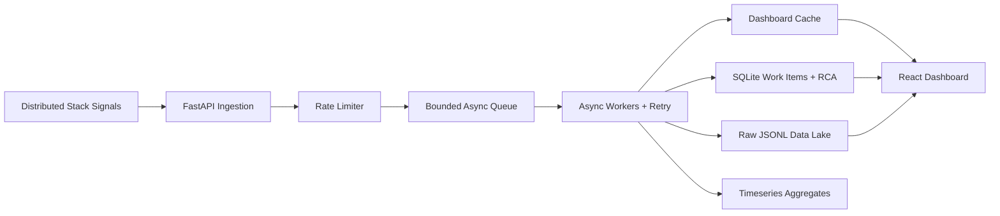

# Mission-Critical Incident Management System

Full-stack IMS assignment for the Zeotap Infrastructure / SRE Intern role.

## Features

- Async signal ingestion with a bounded in-memory queue.
- Debouncing: repeated failures for the same component within 10 seconds map to one active work item while every signal remains linked.
- Separate storage paths for raw signal audit logs, transactional work items/RCA, dashboard cache, and timeseries aggregates.
- Strategy pattern for alert severity/target routing.
- State-machine validation for `OPEN -> INVESTIGATING -> RESOLVED -> CLOSED`.
- Mandatory RCA before closure and automatic MTTR calculation.
- Rate limiting on ingestion, `/health` endpoint, and throughput metrics printed every 5 seconds.
- Responsive React dashboard with live feed, incident detail, raw signals, status updates, and RCA form.
- Unit tests for RCA/state validation.

## Architecture



## Run With Docker Compose

```bash
docker compose up --build
```

- Dashboard: http://localhost:5173
- Backend health: http://localhost:8000/health
- API docs: http://localhost:8000/docs

Seed sample incidents:

```bash
python scripts/seed_failure.py
```

The seed script submits 100 RDBMS signals in one burst and then submits MCP/cache follow-on failures. The RDBMS burst should create one incident with 100 linked raw signals.

## Local Backend Tests

```bash
cd backend
pip install -r requirements.txt
pytest
```

## Backpressure Handling

The ingestion path accepts signals into an `asyncio.Queue` with a fixed maximum size. API handlers return quickly after enqueueing, so slow disk/SQLite writes do not block the request path. If the queue fills, the API reports rejected items instead of crashing the process. Worker tasks drain the queue asynchronously and retry persistence with exponential backoff.

## Data Handling

- Data lake: `raw_signals.jsonl` stores every payload as append-only audit data.
- Source of truth: `source_of_truth.sqlite3` stores work items, RCA, linked signal metadata, and aggregates.
- Hot path: active incident state is cached in memory for dashboard refreshes.
- Aggregations: `signal_aggregates` keeps per-minute component-type counts for future charts and alert analytics.

## Resilience And Security Notes

- Rate limiting protects ingestion from cascading overload.
- SQLite writes run under an async lock to avoid race conditions during status updates and debounce writes.
- RCA closure is rejected unless the incident is `RESOLVED` and the RCA fields are complete.
- CORS is restricted through `IMS_CORS_ORIGINS`.
- Pydantic validates payload shapes, string sizes, timestamps, and RCA fields.
- Health checks are wired into Docker Compose.

## Repository Layout

```text
backend/        FastAPI app, workflow logic, storage layer, tests
frontend/       React/Vite dashboard
sample-data/    Mock distributed-stack failure payloads
scripts/        Data seeding helper
docs/           Architecture and prompt/plan notes
```

## GitHub Link

https://github.com/akash52004?tab=repositories
