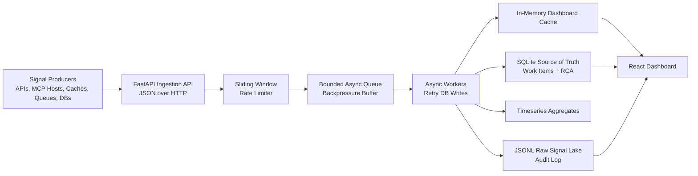

# Architecture

## Storage Responsibilities

- Raw signal lake: `raw_signals.jsonl`, append-only audit trail for high-volume payloads.
- Source of truth: SQLite tables for work items and RCA records with transactional updates.
- Hot path: in-memory dashboard cache refreshed by async workers.
- Aggregations: per-minute counts stored in `signal_aggregates`.

## Design Patterns

- Strategy pattern: `AlertRouter` maps component classes to alert classification strategies.
- State pattern: `WorkItemStateMachine` validates lifecycle transitions and enforces mandatory RCA before `CLOSED`.
